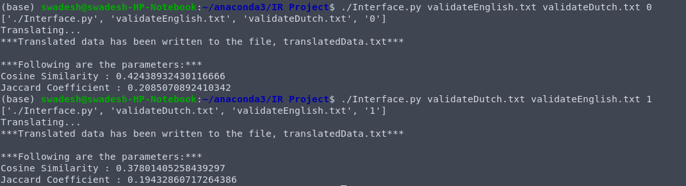

# Cross Lingual Document Translator
This project implements a document translator which can translate English to Dutch and vice-versa. Statistical Machine Translation model has been used. IBM model and EM algorithm have been implemented from scratch.

This project was done as part of the coursework of Information Retrieval at BITS Pilani.

## Aim
Aim of this project is to implement a cross lingual document translator from scratch without using NLTK and python translation libraries. 

## Index
- [Directory structure](#directory-structure-index)
- [Tech used](#tech-used-index)
- [Dev Setup](#dev-setup-index)
- [Dictionary Generation and Testing](#dictionary-generation-and-testing-index)
- [API Reference](#api-reference-index)
- [How to run](#how-to-run-index)
- [Features](#features-index)
- [Challenges and Future scope](#challenges-and-future-scope-index)
- [Credits](#credits-index)


## Directory structure [[Index](#index)]
```bash
.
├── API Reference.pdf
├── README.md
└── src
    ├── IR_Final_Notebook.ipynb
    ├── Interface.py
    ├── ResultsDoc.pdf
    ├── TestSS.png
    ├── dictionaryEtoF.txt
    ├── dictionaryFtoE.txt
    ├── testDtoE.txt
    ├── testEtoD.txt
    ├── validateDutch.txt
    └── validateEnglish.txt
```
- [IR_Final_Notebook.ipynb](src/IR_Final_Notebook.ipynb) contains the code for the model used for document translation
- [Interface.py](src/Interface.py) contains the code which implements the interface that the user interacts with

## Tech used [[Index](#index)]
- python3.8
- Jupyter notebook (This would be used to generate the dictionary which maps English and Dutch words after running the model on the corpus)

## Dev Setup [[Index](#index)]
- Install python either [from source or from PPA](https://tech.serhatteker.com/post/2019-12/how-to-install-python38-on-ubuntu/). Here's how to install python3.8 using PPA:
```bash
sudo apt update
sudo apt install software-properties-common
sudo add-apt-repository ppa:deadsnakes/ppa
sudo apt update
sudo apt install python3.8
```

Check installation by running `python3.8 --version`. You should get `Python 3.8.1` as output.

- To [install jupyter lab](https://jupyter.org/install) use:
```bash
pip install jupyterlab
```

## Dictionary Generation and Testing [[Index](#index)]
- **Dictionary Generation**:
[IR_Final_Notebook.ipynb](src/IR_Final_Notebook.ipynb) contains the implementation of statistical machine translation models. This notebook require a **corpus** (Corpus is a resource consisting of large sets of structured data. We require a corpus of English and Dutch sentences. In this project, we used a gold standard corpus consisting of a Dutch book translated to English by humans). As output, we'll get the dictionary mapping of words (from English to Dutch in [dictionaryEtoF.txt](src/dictionaryEtoF.txt) and from Dutch to English in [dictionaryFtoE.txt](src/dictionaryFtoE.txt).

- **Testing**:
Now that we have dictionary ready, our program written in `Interface.py` can convert a Dutch text to English (and vice-versa) using the dictionaries generated. We have some test files : 
  - [validateDutch.txt](src/validateDutch.txt) contains the text in Dutch to be converted to English. The expected output is present in [validateEnglish.txt](src/validateEnglish.txt) and our output is present in [testDtoE.txt](src/testDtoE.txt).
  - [validateEnglish.txt](src/validateEnglish.txt) contains the text in English to be converted to Dutch. The expected output is present in [validateDutch.txt](src/validateDutch.txt) and our output is present in [testEtoD.txt](src/testEtoD.txt).

The output that we get from our translation is compared with the expected output. Two metrics, namely **Cosine Similarity** and **Jaccard Coefficient**, are used to measure the quality of the translation. For the given test files, the output is present in this [Result](src/ResultsDoc.pdf) document.

## API Reference [[Index](#index)]
For API reference, please refer to [API Reference](API%20Reference.pdf) document.

## How to run [[Index](#index)]
The user will be executing `Interface.py` to test our model and get the translation. While on the command line interface, the user will have to pass three arguments along with the name, `Interface.py`. 
The three arguments would be: 
- Name of test file
- Name of file containing the expected output
- Integer value to indicate whether the user wants a translation from English to Dutch or vice-versa. For English to Dutch, the user will have to pass a value of 0, pass 1 for Dutch to English.

> **NOTE:** *After the translation is done, the translated text is then written into the file, **translatedData.txt** in the same directory. On completion of execution, the program outputs the Jaccard coefficient and cosine similarities between the desired output and the output obtained.*



## Features [[Index](#index)]
1. To optimize the code it has been written in a numpy framework which enables faster execution hence, saving training time.
2. Further, due to computational constraints we have implemented batch training. The corpus was divided into batches of one and a half lakh sentences each.

## Challenges and Future scope [[Index](#index)]
1. One of the major problems we faced is the the proper training of the model. It is quite computationally expensive model - especially from memory perspective. The batch traning that we implemented lead to generation of dictionary for every set of 1.5 lakh sentences and then we merged all the small dictionaries to generate the one complete dictionary. It is a slight deviation from the standard IBM Model 1. The future scope can be to come up with an approach to overcome this challenge.
2. Our model currently used only IBM Model 1. Therefore it doesn't take positional probability into consideration and hence uses almost no context during conversion. This can seriously impair the quality of the translation. The future scope can be to implement other IBM models like 2,3,etc.

## Credits [[Index](#index)]
I hereby acknowledge the contributions of the following:
- [Swadesh Vaibhav](https://github.com/swadesh-vaibhav)
- [Siddhant Kharbandha](https://github.com/the-catalyst)
